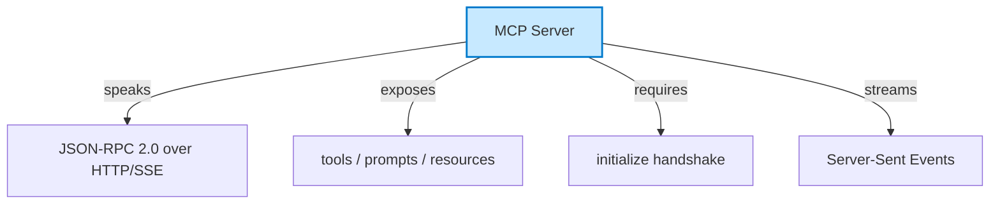
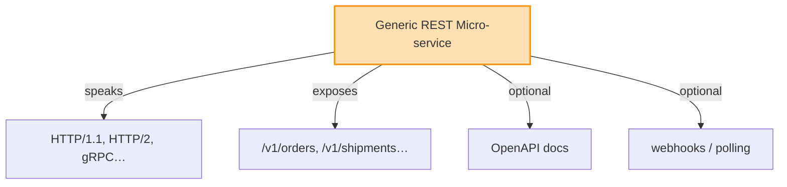
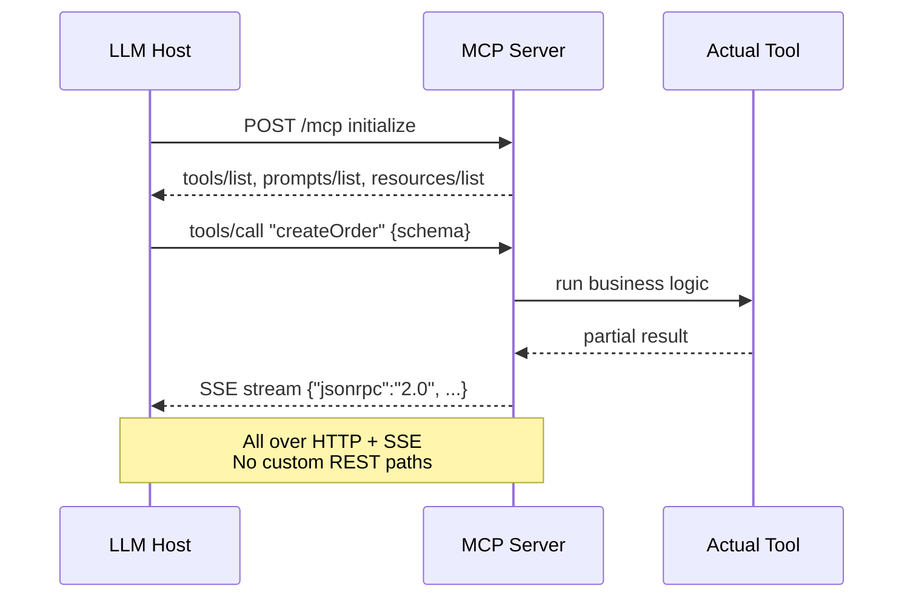

The Model Context Protocol (MCP) already **runs on top of HTTP**—exactly like micro-services-style REST APIs—when it operates in “remote” mode.

**MCP Server (LLM-facing)**



**Generic REST Micro-service (human-client-facing)**





- **Transport**: MCP uses JSON-RPC 2.0 messages that can be carried over plain HTTP **plus** Server-Sent Events (SSE) for bi-directional communication.  
- **Authentication**: It re-uses the same mechanisms you already know from REST—API keys, OAuth tokens, custom headers—so you can secure the endpoint with existing API gateways or service meshes.  
- **Exposing a REST API as MCP**: Cloud providers (e.g., Azure API Management) offer a one-click option to take an existing REST API and surface it as an MCP server without touching the original code.  
- **Conversely, wrapping REST in MCP**: Open-source examples start with a FastAPI or Express REST back-end, then add a thin MCP adapter layer; the LLM now calls the same endpoints through MCP “tools” instead of raw HTTP calls.

In short, you can think of MCP as “REST + structured schema + LLM-friendly discovery layer.” 
Your existing micro-services can stay REST-first and still be consumed by MCP clients, or you can add an MCP façade in front of them—both patterns are already documented and in preview use today.

---

Yes—there **are** real-world micro-service stacks that expose **JSON-RPC 2.0** endpoints **over HTTP/SSE**, and the pattern is gaining traction well beyond the MCP ecosystem.

1. **MCP itself is the clearest example**  
   The Model Context Protocol defines a **“Streamable HTTP”** transport that is pure HTTP micro-service style:  
   - Client → Server: `POST /mcp` with a JSON-RPC payload  
   - Server → Client: single JSON response **or** an SSE stream (`Content-Type: text/event-stream`) for server-push notifications 

2. **Standalone JSON-RPC micro-service frameworks**  
   - **viant/jsonrpc** (Go) ships a ready-made *streaming* transport that speaks JSON-RPC 2.0 over HTTP and **SSE/NDJSON**, explicitly branded as “MCP-compliant” .  
   - Example snippet (Go):
     ```go
     http.Handle("/mcp", streamsrv.New(newHandler))
     http.ListenAndServe(":8080", nil)
     ```
     The same handler can serve both traditional unary calls and long-lived SSE streams.

3. **Gateway & mesh support emerging**  
   - The Kubernetes **Gateway API** community is drafting a `JSONRPCRoute` CRD so that Envoy/NGINX can route **different JSON-RPC methods** to separate micro-service backends, exactly like today’s `HTTPRoute` or `GRPCRoute` .

4. **Industry usage snapshot (mid-2025)**  
   - Roughly **60 % of new internal integrations** surveyed in 2024 opted for lightweight JSON-RPC over REST/gRPC, citing faster onboarding and built-in SSE streaming .  
   - Typical stack: FastAPI / Express / Go-chi on the server side, Postman or Insomnia for testing, deployed behind an API gateway that terminates SSE connections.

So while REST still dominates public APIs, **JSON-RPC 2.0 + SSE** is already a **viable, documented pattern** for micro-services—especially when you need:

- simple RPC semantics  
- real-time server push  
- small payload overhead  
- polyglot clients (browser, mobile, CLI)

…and you can roll it out today with open-source libraries or the MCP reference implementations.

---

Think of the relationship like this:

REST micro-services = “general-purpose HTTP API”  
MCP = “a very opinionated, LLM-centric micro-service that happens to ride on HTTP but changes the contract, lifecycle, and even the **unit of deployment**.”

Below are the **seven hard boundaries** that make MCP *not* just “REST with a different path.”  If you ignore any one of them, you end up with a micro-service that an LLM simply cannot consume correctly.

────────────────────────────────────────
1. Unit of deployment  
   REST: One micro-service = one bounded context, one container/VM.  
   MCP: One **MCP server** = one *tool* (often < 50 LOC).  You can bundle 20–30 MCP servers into the same container, or run them serverless-side-by-side.  The LLM sees every server as a *single capability*, not as a micro-service.

2. Transport contract  
   REST: You may choose HTTP/1.1, HTTP/2, gRPC-Web, WebSockets—any verb, any status code, any MIME type.  
   MCP: **JSON-RPC 2.0 only** over HTTP (POST/SSE) with a strict envelope (`jsonrpc`, `id`, `method`, `params`) and *no* HTTP status codes in the success path.

3. Discovery & introspection  
   REST: OpenAPI/Swagger is optional; clients usually hard-code URLs.  
   MCP: **Mandatory** `initialize` handshake plus `tools/list`, `prompts/list`, `resources/list`.  An LLM literally cannot call anything before this metadata is exchanged.

4. Security boundary  
   REST: AuthN/AuthZ is domain-specific (JWT, mTLS, API keys).  
   MCP: Same primitives **but** the *client* (the LLM host) enforces least-privilege at the **tool** level, not the micro-service level.  One MCP server may expose three tools, each with different scopes.

5. State & streaming model  
   REST: Stateless by convention; long-running jobs use polling or webhooks.  
   MCP: **Server-Sent Events** for bi-directional push is baked in.  A single request can stream partial results *and* receive follow-up prompts from the client in the same connection.

6. Payload schema  
   REST: Free-form JSON, XML, binary blobs.  Schema drift is common.  
   MCP: Every tool call **must** declare its JSON schema (`inputSchema`).  The LLM generates the payload *from* that schema; drift breaks the call.

7. Lifecycle & governance  
   REST: Versioned with SemVer in the URL/headers; breaking changes handled by deprecation policies.  
   MCP: Versioning is **protocol-level** (MCP spec v2024-11-05, etc.).  Individual tools are expected to be immutable; you *add* a new tool instead of bumping a version.

────────────────────────────────────────
Concrete takeaway  
- If you expose `/v1/orders` and `/v1/shipments`, you have a **REST micro-service**.  
- If you expose `tools/list` that returns `{name: "createOrder", inputSchema: {...}}`, you have an **MCP server**.  
- You can run both in the same Kubernetes pod, but the LLM will only “see” the second one.

Those seven distinctions are **non-negotiable**; miss any of them and the contract is no longer MCP.

---

In the broadest architectural sense, yes—an MCP server is a **specialized micro-service**: it is a network-exposed process that offers one or more capabilities over HTTP.  
However, the *specialization* is so strict (JSON-RPC 2.0 envelope, mandatory discovery handshake, SSE streaming, schema-driven tool interface, LLM-centric security model) that it ceases to behave like the REST-style micro-services we usually call “micro-services.”

So, expert shorthand:

• Micro-service (general) – “anything that exposes a network API and can be deployed independently.”  
• MCP server – “a micro-service that must speak the MCP contract so an LLM can discover and invoke it without human-written glue code.”

The moment it stops satisfying that contract, it falls back into the generic micro-service bucket—even if it still runs in a container behind the same gateway.
