Below is a **step-by-step, end-to-end POC** that streams **new orders** from Apache Kafka into **Salesforce Lead objects** in real time.  
Everything runs on localhost so you can clone & run it in ±15 minutes.

> 🔧 Assumptions  
> • You have a **Salesforce Developer Org** (free)  
> • Java 11+, Docker & Docker-Compose are installed  
> • You are comfortable with a terminal

---

### 1️⃣  Architecture (30-sec view)

```
┌--------------┐     ┌------------------┐     ┌--------------┐
│  Kafka topic │ --> │ Kafka Connect    │ --> │   Salesforce │
│  orders-json │     │ Salesforce Sink  │     │   Lead sObj  │
└--------------┘     └------------------┘     └--------------┘
```

---

### 2️⃣  Spin up Kafka & Kafka Connect (Docker)

`docker-compose.yml`

```yaml
version: "3.8"
services:
  zookeeper:
    image: confluentinc/cp-zookeeper:7.6.0
    environment:
      ZOOKEEPER_CLIENT_PORT: 2181

  kafka:
    image: confluentinc/cp-kafka:7.6.0
    depends_on: [zookeeper]
    ports:
      - "9092:9092"
    environment:
      KAFKA_ZOOKEEPER_CONNECT: zookeeper:2181
      KAFKA_ADVERTISED_LISTENERS: PLAINTEXT://localhost:9092
      KAFKA_OFFSETS_TOPIC_REPLICATION_FACTOR: 1

  connect:
    image: confluentinc/cp-kafka-connect:7.6.0
    depends_on: [kafka]
    ports:
      - "8083:8083"
    environment:
      CONNECT_BOOTSTRAP_SERVERS: kafka:9092
      CONNECT_REST_PORT: 8083
      CONNECT_GROUP_ID: compose-connect
      CONNECT_CONFIG_STORAGE_TOPIC: _connect-configs
      CONNECT_OFFSET_STORAGE_TOPIC: _connect-offsets
      CONNECT_STATUS_STORAGE_TOPIC: _connect-status
      CONNECT_KEY_CONVERTER: org.apache.kafka.connect.storage.StringConverter
      CONNECT_VALUE_CONVERTER: org.apache.kafka.connect.json.JsonConverter
      CONNECT_PLUGIN_PATH: /usr/share/java,/usr/share/confluent-hub-components
    volumes:
      - ./salesforce-connector:/usr/share/confluent-hub-components/salesforce
```

Install the **Salesforce Sink connector** once:

```bash
confluent-hub install --no-prompt confluentinc/kafka-connect-salesforce:2.0.3 \
  --component-dir ./salesforce-connector
```

Bring everything up:

```bash
docker-compose up -d
```

---

### 3️⃣  Prepare Salesforce

1. Log in to your **Developer Org**  
2. **Reset Security Token** (My Settings → Reset My Security Token) – you’ll get it via e-mail.  
3. Create a **Connected App**  
   - Setup → App Manager → New Connected App  
   - Enable OAuth → select scope **Access & manage your data (api)**  
   - Note Consumer Key & Consumer Secret.

---

### 4️⃣  Create Kafka topic & seed data

```bash
# topic
docker exec -it kafka kafka-topics --create --topic orders-json --bootstrap-server localhost:9092 --partitions 1 --replication-factor 1

# quick producer (runs in foreground, Ctrl-C to stop)
docker exec -it kafka kafka-console-producer --topic orders-json --bootstrap-server localhost:9092
```

Paste sample JSON lines:

```json
{"FirstName":"Ada","LastName":"Lovelace","Company":"Analytical Engine Inc.","Email":"ada@example.com","Status":"Open - Not Contacted"}
{"FirstName":"Grace","LastName":"Hopper","Company":"Compilers LLC","Email":"grace@example.com","Status":"Working - Contacted"}
```

---

### 5️⃣  Configure the Salesforce Sink connector

`salesforce-sink.json`

```json
{
  "name": "sf-leads-sink",
  "config": {
    "connector.class": "io.confluent.salesforce.SalesforceSObjectSinkConnector",
    "tasks.max": "1",
    "topics": "orders-json",
    "salesforce.object": "Lead",
    "salesforce.instance": "https://login.salesforce.com",
    "salesforce.username": "<YOUR_DEV_USERNAME>",
    "salesforce.password": "<YOUR_PASSWORD><SECURITY_TOKEN>",
    "salesforce.consumer.key": "<CONNECTED_APP_CONSUMER_KEY>",
    "salesforce.consumer.secret": "<CONNECTED_APP_CONSUMER_SECRET>",
    "salesforce.use.bulk.api": "false",
    "key.converter": "org.apache.kafka.connect.storage.StringConverter",
    "value.converter": "org.apache.kafka.connect.json.JsonConverter"
  }
}
```

Deploy:

```bash
curl -X POST http://localhost:8083/connectors \
  -H "Content-Type: application/json" \
  -d @salesforce-sink.json
```

---

### 6️⃣  Verify

1. **Kafka Connect logs**  
   `docker logs <connect-container-id> | grep "processed"`

2. **Salesforce UI → Leads** – you should see **Ada** & **Grace** within seconds.

---

### 7️⃣  Clean-up

```bash
docker-compose down -v
```

---

### 🔍 Where to go next

| Area            | Production-grade ideas |
|-----------------|------------------------|
| **Security**    | SSL/SASL for Kafka, OAuth2 refresh tokens for Salesforce |
| **Throughput**  | Increase `tasks.max`, use Bulk API (`salesforce.use.bulk.api=true`) |
| **Schema**      | Switch to Avro + Confluent Schema Registry |
| **Monitoring**  | Prometheus JMX exporter, Salesforce API usage dashboards |

---

### 📚 References

- Step-by-step screenshots: Hevo blog   
- Full connector options: RudderStack guide   
- Docker setup sample: Medium article 

You now have a **minimal but complete POC** that you can demo, extend, or harden into production.

---

The mapping **is implicit** in the connector configuration.  
The connector simply **takes every top-level JSON field whose name matches a Salesforce Lead field** and copies the value across.  
So when the JSON message

```json
{
  "FirstName": "Ada",
  "LastName":  "Lovelace",
  "Company":   "Analytical Engine Inc.",
  "Email":     "ada@example.com",
  "Status":    "Open - Not Contacted"
}
```

arrives on topic `orders-json`, the Salesforce Sink connector:

1. reads the JSON object as a flat `Map<String,Object>`,
2. maps each key **name-for-name** to the Lead field of the same API name,
3. builds a REST `POST /sobjects/Lead` request with those key/value pairs.

That is all the mapping that happens **out of the box**.

---

### Want explicit mapping?

If your Kafka JSON keys **do not** match Salesforce API names (or you want to ignore or transform some), you can override it with the connector’s `transforms` section, e.g.

```json
"transforms": "MapFields",
"transforms.MapFields.type": "org.apache.kafka.connect.transforms.ReplaceField$Value",
"transforms.MapFields.renames": "first_name:FirstName,last_name:LastName,cust_email:Email"
```

or use a single-message-transform (SMT) such as `Flatten`, `Cast`, or a custom JSLT transform.

But in the POC above, no extra mapping is configured; **field-name equality** is the rule.

---

Exactly — that’s the entire contract:

* `"salesforce.object": "Lead"` **explicitly** tells the connector *which* Salesforce object to target.  
* Every top-level key in the JSON message is **implicitly** assumed to be a writable field on that object (FirstName → Lead.FirstName, LastName → Lead.LastName, etc.).

If the keys don’t line up, or you need to rename / ignore / cast, then you’d layer on a transform; otherwise the default “field-name equality” mapping is all that’s required.

---

Yes, **provided** you expose the right fields in the Kafka message and configure the connector appropriately.

1. **Primary key for Contact**  
   Kafka messages must contain a field that maps to a **Contact External-ID field** (standard or custom).  
   Example message:

   ```json
   {
     "ContactExtId__c": "CUST-12345",   // new external id of the contact
     "FirstName": "John",
     "LastName":  "Doe",
     "Email":     "john.doe@acme.com"
   }
   ```

2. **Link to the parent Account**  
   Add an **Account External-ID field** value so the connector can resolve the relationship:

   ```json
   {
     "ContactExtId__c": "CUST-12345",
     "FirstName": "John",
     "LastName":  "Doe",
     "Email":     "john.doe@acme.com",
     "AccountExtId__c": "ACC-98765"
   }
   ```

3. **Connector configuration**  
   ```json
   "salesforce.object": "Contact",
   "salesforce.use.primary.keys": "true",
   "salesforce.external.id.field": "ContactExtId__c",
   "salesforce.reference.fields": "AccountExtId__c:Account"
   ```

   • `ContactExtId__c` is declared as the external-id for upserts.  
   • `AccountExtId__c` is mapped to the `Account` lookup via its own external-id.

That’s all that is required: the connector will upsert the Contact, create it if the external id doesn’t exist, and automatically wire it to the Account whose external id matches `ACC-98765`.

---

Thanks!  
Below is the **ultra-compact “one-liner” version**—a single `docker-compose.yml` you can copy-paste to spin up the whole POC in ~2 minutes.

---

### 📦 Single-file Docker-Compose (Kafka + Kafka-Connect + Salesforce Sink)

`docker-compose.yml`

```yaml
version: "3.8"
services:
  zookeeper:
    image: confluentinc/cp-zookeeper:7.6.0
    environment:
      ZOOKEEPER_CLIENT_PORT: 2181

  kafka:
    image: confluentinc/cp-kafka:7.6.0
    depends_on: [zookeeper]
    ports:
      - "9092:9092"
    environment:
      KAFKA_ZOOKEEPER_CONNECT: zookeeper:2181
      KAFKA_ADVERTISED_LISTENERS: PLAINTEXT://localhost:9092

  connect:
    image: confluentinc/cp-kafka-connect:7.6.0
    depends_on: [kafka]
    ports:
      - "8083:8083"
    environment:
      CONNECT_BOOTSTRAP_SERVERS: kafka:9092
      CONNECT_REST_PORT: 8083
      CONNECT_GROUP_ID: quick-poc
      CONNECT_CONFIG_STORAGE_TOPIC: _cfg
      CONNECT_OFFSET_STORAGE_TOPIC: _off
      CONNECT_STATUS_STORAGE_TOPIC: _stat
      CONNECT_KEY_CONVERTER: org.apache.kafka.connect.storage.StringConverter
      CONNECT_VALUE_CONVERTER: org.apache.kafka.connect.json.JsonConverter
      CONNECT_PLUGIN_PATH: /usr/share/java,/opt/connectors
    volumes:
      - ./connectors:/opt/connectors
    command: >
      bash -c
      "confluent-hub install --no-prompt confluentinc/kafka-connect-salesforce:2.0.3 --component-dir /opt/connectors &&
       /etc/confluent/docker/run"
```

---

### 🔧 Two-minute start

```bash
# 1. create folder for connector download
mkdir -p connectors

# 2. bring everything up
docker compose up -d          # or docker-compose up -d

# 3. create topic
docker exec -it kafka kafka-topics --create --topic orders-json --bootstrap-server localhost:9092 --partitions 1 --replication-factor 1

# 4. post connector config (edit file with your SF creds first)
curl -X POST http://localhost:8083/connectors -H "Content-Type: application/json" -d @sf-leads-sink.json
```

That’s it—no local Java installs, no manual connector downloads.  
Happy streaming!

---

On Windows you have two easy options:

1. **Docker Desktop for Windows** (the usual choice)  
   • Download `Docker Desktop Installer.exe` from https://docs.docker.com/desktop/install/windows-install/  
   • Double-click → next-next-finish.  
   • It bundles both **Docker Engine** and **docker-compose v2** (the `docker compose` CLI plugin).  
   • After install open PowerShell or CMD and verify:  
     ```
     docker --version
     docker compose version
     ```
   • You can now `docker compose up -d` anywhere.

2. **No Desktop, just CLI** (rare)  
   If you only want the CLI inside WSL2 or Git-Bash, you can grab the static binaries, but 99 % of Windows users simply run the installer above.

So yes: **one .exe** → Docker Desktop → `docker` and `docker compose` commands are immediately available in any terminal.

---

No extra Java 11+ install is needed **because everything runs inside Docker**.  
The images (`confluentinc/cp-*`) already contain the correct OpenJDK 11 runtime for:

* Kafka broker  
* ZooKeeper  
* Kafka Connect worker  
* The Salesforce connector JAR

So on the **host OS (Windows)** you only need:

1. Docker Desktop (one `.exe`)  
2. A terminal (PowerShell, CMD, or Git Bash) to run `docker compose up`

→ **Java is only inside the containers; your Windows machine stays Java-free.**

---

Exactly – the sentence was phrased for the **generic / non-Docker** case.

* If you want to run **Kafka command-line tools locally** (e.g. `kafka-console-producer` outside of any container) then you need a **local Java 11+** on the host.  
* If you stay **entirely inside Docker**, the Java runtime is already baked into the Confluent images, so you don’t need Java on the host at all.

For this POC we stay 100 % in Docker, so you can ignore the host-Java requirement.

---

Here is a **line-by-line walk-through** of the file we use in the POC.

```yaml
version: "3.8"
```
• Declares the Docker-Compose file format version (3.8 is current and supports all modern Compose features).

---

### ZooKeeper service
```yaml
services:
  zookeeper:
    image: confluentinc/cp-zookeeper:7.6.0
```
• Pulls the **Confluent Platform ZooKeeper** image that matches Kafka 7.6.0.  
• ZooKeeper is only needed while we run a single-broker dev cluster; in production you’d switch to KRaft mode.

```yaml
    environment:
      ZOOKEEPER_CLIENT_PORT: 2181
```
• Exposes the standard client port on 2181 **inside the container network**; Kafka will use `zookeeper:2181`.

---

### Kafka broker
```yaml
  kafka:
    image: confluentinc/cp-kafka:7.6.0
    depends_on: [zookeeper]
```
• Starts after ZooKeeper is healthy.

```yaml
    ports:
      - "9092:9092"
```
• Publishes the broker’s **PLAINTEXT listener** on your **host port 9092**, so you can produce/consume from Windows/WSL without being inside Docker.

```yaml
    environment:
      KAFKA_ZOOKEEPER_CONNECT: zookeeper:2181
      KAFKA_ADVERTISED_LISTENERS: PLAINTEXT://localhost:9092
```
• Tells the broker where ZooKeeper lives (`zookeeper:2181`).  
• Advertises itself to clients as `localhost:9092` (reachable from the host).

```yaml
      KAFKA_OFFSETS_TOPIC_REPLICATION_FACTOR: 1
```
• In a single-broker dev cluster you must drop the replication factor to 1; otherwise topic creation would fail.

---

### Kafka Connect worker
```yaml
  connect:
    image: confluentinc/cp-kafka-connect:7.6.0
    depends_on: [kafka]
```
• Dedicated **Connect runtime** (separate from the broker) so we can plug in the Salesforce sink JAR.

```yaml
    ports:
      - "8083:8083"
```
• Exposes the REST API on host port 8083; you’ll POST the connector config to `http://localhost:8083/connectors`.

```yaml
    environment:
      CONNECT_BOOTSTRAP_SERVERS: kafka:9092
      CONNECT_REST_PORT: 8083
      CONNECT_GROUP_ID: quick-poc
```
• Bootstrap servers inside the Docker network (`kafka:9092`).  
• Simple consumer-group name for this demo.

```yaml
      CONNECT_CONFIG_STORAGE_TOPIC: _cfg
      CONNECT_OFFSET_STORAGE_TOPIC: _off
      CONNECT_STATUS_STORAGE_TOPIC: _stat
```
• Three **internal Kafka topics** that Connect uses to persist its own state; short names keep the demo tidy.

```yaml
      CONNECT_KEY_CONVERTER: org.apache.kafka.connect.storage.StringConverter
      CONNECT_VALUE_CONVERTER: org.apache.kafka.connect.json.JsonConverter
```
• Tells Connect that keys are plain strings and values are JSON (no Schema Registry for this quick POC).

```yaml
      CONNECT_PLUGIN_PATH: /usr/share/java,/opt/connectors
```
• Two directories Connect will scan for connector JARs.  
  – `/usr/share/java` already contains the built-in converters.  
  – `/opt/connectors` (next line) is our mount point for the Salesforce sink.

```yaml
    volumes:
      - ./connectors:/opt/connectors
```
• Binds the host folder `connectors/` (relative to the compose file) into the container at `/opt/connectors`, so we can drop the Salesforce JAR there.

```yaml
    command: >
      bash -c
      "confluent-hub install --no-prompt confluentinc/kafka-connect-salesforce:2.0.3 --component-dir /opt/connectors &&
       /etc/confluent/docker/run"
```
• **Self-install hook**: when the container first starts it downloads the Salesforce sink connector into `/opt/connectors`, then starts the Connect worker.

---

That’s everything.  Each service is lightweight, stateless (except for the topics), and disappears when you `docker compose down -v`.

---


Below are two ready-to-copy **Mermaid diagrams** that visualise the entire mini-POC:  
- **runtime view** (containers, internal/external ports, message flow)  
- **logical topic view** (Kafka → Salesforce Lead/Contact via external ids)

---

### 1. Runtime Architecture (Docker & Salesforce)

```mermaid
flowchart TD
    subgraph Host ["Windows Host"]
        P[PowerShell / CMD]
    end

    subgraph Docker ["Docker Compose default network (quick-poc_default)"]
        ZK("zookeeper:2181")
        K("kafka:9092")
        C("connect:8083")
    end

    subgraph Ports ["Port Mapping"]
        K -->|9092:9092| Host
        C -->|8083:8083| Host
    end

    subgraph Salesforce ["Salesforce Cloud"]
        SF([Lead / Contact sObjects])
    end

    P -->|docker exec … kafka-console-producer| K
    K -->|orders-json| C
    C -->|HTTPS 443| SF
```



Key points  
- **Container-to-container traffic** uses service names (`zookeeper`, `kafka`, `connect`) inside the automatically-created user-defined network `quick-poc_default` .  
- **Host-to-container traffic** uses the mapped ports `localhost:9092` and `localhost:8083` .  
- **Kafka Connect → Salesforce** is plain HTTPS/443; no extra firewall rules beyond normal internet egress.

---

### 2. Topic & Mapping Flow (Lead vs Contact w/ External IDs)

```mermaid
flowchart LR
    subgraph Kafka_Topics ["Kafka Topics"]
        ORDERS["orders-json"]
        CONTACTS["contacts-json"]
    end

    subgraph Connector_Config ["Kafka-Connect Config"]
        CFG_Lead("salesforce.object = Lead")
        CFG_Contact("salesforce.object = Contact\nsalesforce.external.id.field = ContactExtId__c")
    end

    subgraph Salesforce_Objects ["Salesforce Objects"]
        Lead("Lead\nFirstName, LastName, …")
        Contact("Contact\nFirstName, LastName,\nAccountExtId__c, ContactExtId__c")
    end

    ORDERS --> CFG_Lead --> Lead
    CONTACTS --> CFG_Contact --> Contact
```



- **Lead scenario** relies on **implicit field-name mapping** (top-level JSON keys match Lead API names).  
- **Contact scenario** adds **explicit external-id mapping** (`ContactExtId__c`) plus the parent-account reference (`AccountExtId__c`) so new Contacts are upserted and linked in one shot.

Copy either diagram into any Mermaid renderer (e.g. mermaid.live) to view or edit.

---

Security layer between Kafka Connect and Salesforce is **exclusively the public Salesforce REST API over HTTPS**—no SOAP is used.

| Item | Detail |
|---|---|
| **Protocol** | Salesforce REST API (`/services/data/vXX.X/sobjects/…`) over **HTTPS/443**. |
| **Authentication** | OAuth 2.0 via a **Connected App**—client-credentials or username-password flow—yielding an **access token + optional refresh token**. |
| **Transport security** | TLS 1.2/1.3 enforced by Salesforce; no additional WS-Security layer (SOAP) is involved. |
| **API version** | Connector pins a recent REST version (e.g. v60.0) and calls **composite collections** when `salesforce.use.bulk.api=true` for high-throughput upserts. |
| **Permissions** | The Connected App must have **“Access and manage your data (api)”** OAuth scope and the user profile must have **API Enabled**. |
| **Token refresh** | If you choose the username-password flow the connector concatenates `password+security_token`; token refresh is automatic via the refresh token if you use the client-credentials flow. |
| **No Streaming or SOAP** | The sink connector does **not** create PushTopics, subscribe to Platform Events, nor use the Salesforce SOAP API. It simply performs synchronous or bulk REST calls to create/update/delete individual sObjects. |

So, from the Kafka Connect worker’s perspective, every record becomes a JSON payload in a **stateless HTTPS POST/PATCH** to Salesforce’s REST endpoints, protected by TLS and OAuth 2.0.

---

Security layer between Kafka Connect and Salesforce is **exclusively the public Salesforce REST API over HTTPS**—no SOAP is used.

| Item | Detail |
|---|---|
| **Protocol** | Salesforce REST API (`/services/data/vXX.X/sobjects/…`) over **HTTPS/443**. |
| **Authentication** | OAuth 2.0 via a **Connected App**—client-credentials or username-password flow—yielding an **access token + optional refresh token**. |
| **Transport security** | TLS 1.2/1.3 enforced by Salesforce; no additional WS-Security layer (SOAP) is involved. |
| **API version** | Connector pins a recent REST version (e.g. v60.0) and calls **composite collections** when `salesforce.use.bulk.api=true` for high-throughput upserts. |
| **Permissions** | The Connected App must have **“Access and manage your data (api)”** OAuth scope and the user profile must have **API Enabled**. |
| **Token refresh** | If you choose the username-password flow the connector concatenates `password+security_token`; token refresh is automatic via the refresh token if you use the client-credentials flow. |
| **No Streaming or SOAP** | The sink connector does **not** create PushTopics, subscribe to Platform Events, nor use the Salesforce SOAP API. It simply performs synchronous or bulk REST calls to create/update/delete individual sObjects. |

So, from the Kafka Connect worker’s perspective, every record becomes a JSON payload in a **stateless HTTPS POST/PATCH** to Salesforce’s REST endpoints, protected by TLS and OAuth 2.0.

---

Yes — the **Confluent Salesforce Sink connector** already supports **Salesforce Bulk REST API v2** and you can switch it on with **two extra lines** in the connector JSON (or environment variables if you use the Docker image).  
Below is the **minimal delta** you need on top of the previous POC to move from *single-record REST calls* to **high-throughput bulk batches** when running Kafka in Docker.

---

### 1. Connector-level toggle

```json
"salesforce.use.bulk.api": "true",
"salesforce.bulk.api.max.records.per.batch": "10000"
```

- `use.bulk.api=true` changes the underlying API from *synchronous REST* to **Bulk REST v2** (`/jobs/ingest`).  
- `max.records.per.batch` (default 10 000) controls how many Kafka records are bundled into one Salesforce job; raise it if you have **very high volume**.  
- The connector will automatically **chunk**, **poll job status**, and **retry failed batches**.

---

### 2. Docker / resource hints for high volume

| Item | Compose snippet | Why |
|---|---|---|
| **CPU & RAM** | `deploy: resources: limits: cpus: '4', memory: 4G` | Bulk ingest is CPU-light but RAM helps large batch buffering |
| **Persistent SSD volume** | `volumes: - ./kafka-data:/var/lib/kafka/data` | Guarantees log retention across restarts and avoids I/O bottlenecks |
| **Large message support** | `KAFKA_MESSAGE_MAX_BYTES: 10485760` (10 MB) | Only if individual records > 1 MB |
| **Producer tuning** (optional) | `batch.size=200000`, `linger.ms=100`, `compression.type=lz4` | Bigger, compressed producer batches reduce per-record overhead |

---

### 3. Full one-file compose with bulk-ready sink

```yaml
services:
  kafka:
    image: confluentinc/cp-kafka:7.6.0
    ports:
      - "9092:9092"
    environment:
      KAFKA_ZOOKEEPER_CONNECT: zookeeper:2181
      KAFKA_ADVERTISED_LISTENERS: PLAINTEXT://localhost:9092
      KAFKA_OFFSETS_TOPIC_REPLICATION_FACTOR: 1
      KAFKA_MESSAGE_MAX_BYTES: 10485760   # if you send big records
    volumes:
      - ./kafka-data:/var/lib/kafka/data   # fast SSD mount

  connect:
    image: confluentinc/cp-kafka-connect:7.6.0
    ports:
      - "8083:8083"
    environment:
      CONNECT_BOOTSTRAP_SERVERS: kafka:9092
      CONNECT_REST_PORT: 8083
      CONNECT_GROUP_ID: bulk-poc
      CONNECT_CONFIG_STORAGE_TOPIC: _cfg
      CONNECT_OFFSET_STORAGE_TOPIC: _off
      CONNECT_STATUS_STORAGE_TOPIC: _stat
      CONNECT_KEY_CONVERTER: org.apache.kafka.connect.storage.StringConverter
      CONNECT_VALUE_CONVERTER: org.apache.kafka.connect.json.JsonConverter
      CONNECT_PLUGIN_PATH: /usr/share/java,/opt/connectors
    volumes:
      - ./connectors:/opt/connectors
    command: >
      bash -c "confluent-hub install --no-prompt confluentinc/kafka-connect-salesforce:2.0.3 --component-dir /opt/connectors &&
               /etc/confluent/docker/run"
```

---

### 4. Connector JSON with bulk enabled

```json
{
  "name": "sf-leads-bulk",
  "config": {
    "connector.class": "io.confluent.salesforce.SalesforceSObjectSinkConnector",
    "tasks.max": "4",
    "topics": "orders-json",
    "salesforce.object": "Lead",
    "salesforce.use.bulk.api": "true",
    "salesforce.bulk.api.max.records.per.batch": "10000",
    "salesforce.username": "<user>",
    "salesforce.password": "<pass+token>",
    "salesforce.consumer.key": "<key>",
    "salesforce.consumer.secret": "<secret>"
  }
}
```

- Increase `tasks.max` (≤ available CPU cores) to **parallelise ingest jobs**; each task creates its own Bulk API job.

---

Result: Kafka → Bulk REST v2 → Salesforce handles **hundreds of thousands of records per minute** with a single-node Docker setup.

----

### ✅ Quick answer  
For **Bulk REST API v2** (the mode the connector switches on with `salesforce.use.bulk.api=true`) **each batch file must be ≤ 10 MB** (≈ 8–9 k records) .  
That 10 MB ceiling is the **only hard limit** you need to respect when sizing Kafka messages that will land in Salesforce via Bulk API.

---

### 📏 What the numbers look like

| API flavour | Max batch / request | Notes |
|-------------|---------------------|-------|
| **Bulk REST v2** (used by the connector) | **10 MB per batch file** | Salesforce auto-splits ≥ 10 k records into additional batches . |
| Classic single-record REST | 6 MB (synchronous) / 12 MB (asynchronous) | Not used when Bulk API is enabled . |
| File uploads (ContentVersion) | **2 GB** via special endpoints | **Irrelevant** for Kafka → Lead/Contact data loads . |

---

### ⚙️ Practical tuning for Kafka → Docker → Salesforce

1. **Kafka broker**  
   Keep `message.max.bytes` **≤ 10 MB** so that one Kafka record (or a compressed batch) never exceeds Salesforce’s **10 MB Bulk API batch** limit.

2. **Connector**  
   Set  
   ```json
   "salesforce.use.bulk.api": "true",
   "salesforce.bulk.api.max.records.per.batch": "10000"
   ```
   and the connector will automatically chunk any larger stream into **≤ 10 MB** ingest jobs.

3. **Result**  
   You can safely stream **millions of rows per hour** without ever hitting the 10 MB cap, as long as each individual batch stays under that size.

---

### 🔍 Clarifying the “12 MB” figure

- **Salesforce Bulk API v2** (the mode the Kafka connector uses) has a **hard limit of 10 MB per batch file** .  
- The **12 MB** you saw in some docs refers to **asynchronous Apex** governor limits (for code running inside Salesforce) and **NOT** to the Bulk REST API ingest endpoint .  
- Therefore, when streaming from Kafka → Docker → Salesforce, **anything above 10 MB per individual batch will be rejected** by Bulk API v2.

### ✅ Safe sizing checklist

| Layer | What to check / set |
|---|---|
| **Kafka broker** | `message.max.bytes` ≤ **10 485 760** bytes (10 MB) |
| **Kafka producer** | `max.request.size` ≤ 10 MB |
| **Kafka topic** | `max.message.bytes` ≤ 10 MB (per topic override) |
| **Kafka Connect** | `salesforce.bulk.api.max.records.per.batch` keeps each **generated** batch ≤ 10 MB |

Staying at or below **10 MB** guarantees the connector’s Bulk API calls will never be blocked by Salesforce.

---

Below are **copy-paste commands** you can run from any terminal (Windows PowerShell, CMD, Git-Bash, WSL, Linux) to **supervise** the POC while it is running.  
They assume:

- Docker containers are up (`docker compose up -d`)  
- Docker ports are mapped to the host (`9092`, `8083`)  
- Optional: you have a **local JDK 11+** if you want to use the native Kafka CLI

---

### 1. Container health & logs
```bash
# quick overview
docker ps

# logs for all services (Ctrl-C to exit)
docker compose logs -f

# only Kafka broker
docker logs -f kafka

# only Kafka Connect
docker logs -f connect
```

---

### 2. Kafka cluster topics & offsets
```bash
# list topics
docker exec -it kafka kafka-topics --bootstrap-server localhost:9092 --list

# describe topic (partitions, replicas, offsets, leader)
docker exec -it kafka kafka-topics --bootstrap-server localhost:9092 --describe --topic orders-json

# watch consumer lag (built-in)
docker exec -it kafka kafka-consumer-groups --bootstrap-server localhost:9092 --describe --group connect-sf-leads-sink
```

---

### 3. Kafka Connect runtime
```bash
# list connectors
curl -s http://localhost:8083/connectors | jq

# status of the SF sink
curl -s http://localhost:8083/connectors/sf-leads-sink/status | jq

# tail connector logs
docker logs -f connect | grep sf-leads-sink
```

---

### 4. Produce / consume test messages (native CLI or Docker)
```bash
# produce a quick test line (inside container)
docker exec -it kafka kafka-console-producer \
  --broker-list localhost:9092 \
  --topic orders-json

# consume last 10 messages (inside container)
docker exec -it kafka kafka-console-consumer \
  --bootstrap-server localhost:9092 \
  --topic orders-json \
  --from-latest \
  --max-messages 10
```

If you installed **JDK 11+** locally, you can omit `docker exec -it kafka …` and just run `kafka-console-producer --bootstrap-server localhost:9092 …`.

---

### 5. Salesforce side (quick smoke test)
```bash
# count newly created Leads in last hour via Salesforce CLI (needs `sfdx`)
sfdx force:data:soql:query -q "SELECT COUNT() FROM Lead WHERE CreatedDate = LAST_N_HOURS:1"
```

---

### 6. One-liner “traffic light” script
```bash
echo "=== Kafka topics ===" \
&& docker exec kafka kafka-topics --bootstrap-server localhost:9092 --list \
&& echo "=== Connector status ===" \
&& curl -s http://localhost:8083/connectors/sf-leads-sink/status | jq '.tasks[].state'
```

If the last line prints `"RUNNING"` for every task, the pipeline is healthy.

---

Because the **Docker image already ships the full Kafka distribution** (`/usr/bin/kafka-*`) inside the container, every CLI tool is **instantly available** without installing anything locally.  
In practice:

1. **No local JDK or Kafka install** → you still run:
   ```bash
   docker exec -it <kafka-container> kafka-topics --bootstrap-server localhost:9092 --list
   ```
   The command is executed **inside the running container**, so the image’s own JDK and scripts are used.

2. **If you prefer shorter commands** you can create **host aliases** (PowerShell function or shell alias) that wrap the `docker exec …` call, e.g.:

   PowerShell
   ```powershell
   function kt { docker exec -it kafka kafka-topics --bootstrap-server localhost:9092 $args }
   ```
   then simply type:
   ```powershell
   kt --list
   ```

3. **Only install JDK 11+ locally** if you want to run **native binaries** (`kafka-console-producer.bat`, `kafka-topics.bat`, etc.) **outside** Docker—useful for IDEs, CI, or when Docker isn’t running. Otherwise, the Docker image already gives you **all commands “for free.”**

---
